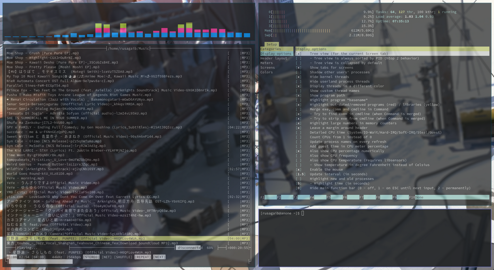
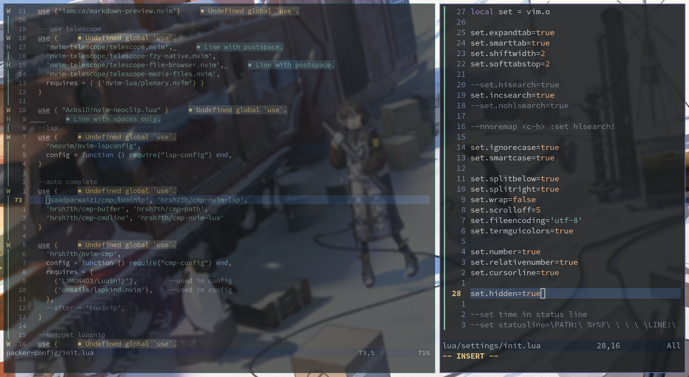

# dotfiles
my dotfile w/ bspwm, sxhkd, alacritty, nvim, mocp-config etc..

### main hq :sweat_smile:
tbh i dont want flex anything & i just put a basic endavourOS 
theme tho, that comes with WM version bspwm community edition..

### neovim :fire:

 

### Buy me some coffe :coffee:
  * https://ko-fi.com/rusagaib

### Sawer ngab :dancers: 
  * https://saweria.co/rusagaib
